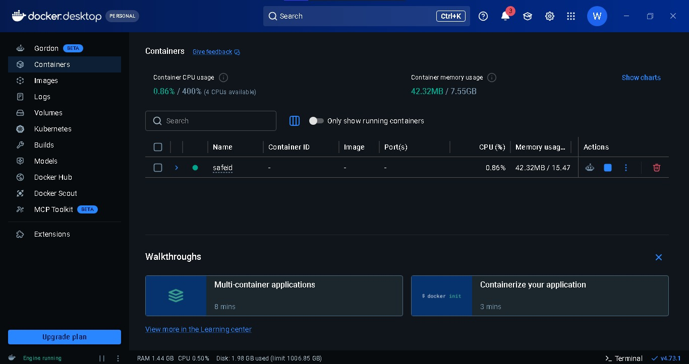
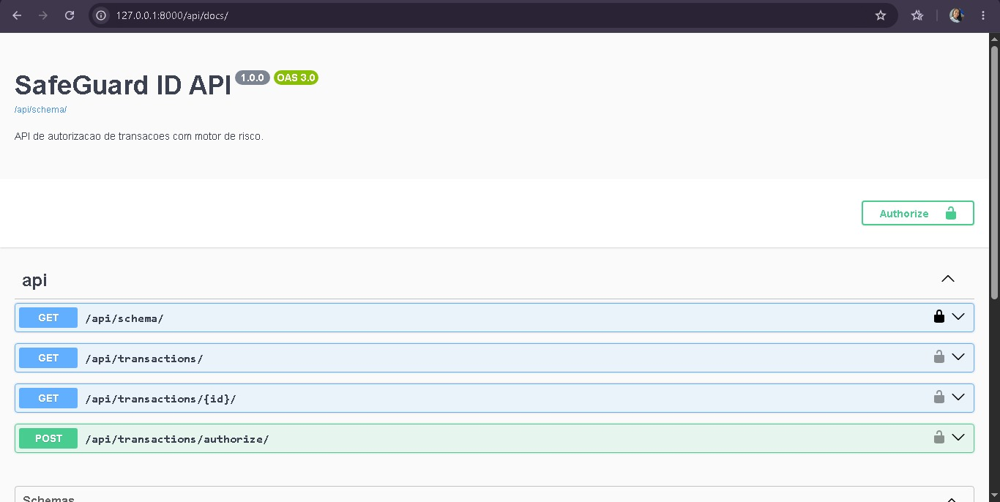

# 🛡️ SafeGuard ID

API backend para autorização de transações com avaliação de risco, desenvolvida com Django, Django REST Framework, PostgreSQL, Redis e Swagger/OpenAPI.

O projeto recebe uma transação, captura dados da requisição, calcula o risco, salva a decisão no banco e retorna se a operação foi aprovada ou rejeitada.

## 📌 Sumário

- [🚀 Stack](#stack)
- [✅ Funcionalidades](#funcionalidades)
- [📸 Demonstração e evidências técnicas](#demonstracao)
- [🏗️ Arquitetura](#arquitetura)
- [⚙️ Como rodar](#como-rodar)
- [🔐 Variáveis de ambiente](#variaveis)
- [🌐 Endpoints](#endpoints)
- [🧪 Exemplos](#exemplos)
- [✅ Testes](#testes)
- [📚 Documentação](#documentacao)
- [🐳 Docker](#docker)
- [🟢 Status do projeto](#status)
- [📋 Checklist antes de publicar no GitHub](#checklist)

<a id="stack"></a>

## 🚀 Stack

- Python 3.12
- Django 5.0
- Django REST Framework
- PostgreSQL
- Redis
- drf-spectacular
- Docker Compose

<a id="funcionalidades"></a>

## ✅ Funcionalidades

- Autorização de transações via API REST.
- Captura automática de IP e User-Agent.
- Motor de risco com score e razões de decisão.
- Rejeição por valor acima de `10000.00`.
- Rejeição por device fingerprint em blacklist.
- Blacklist persistida em banco e gerenciável pelo Django Admin.
- Autenticação por API key usando o header `X-API-Key`.
- Rate limiting por IP usando Redis.
- Contrato de erro padronizado.
- Logs estruturados em JSON.
- Swagger UI em `/api/docs/`.
- Testes automatizados com DRF `APITestCase`.

<a id="demonstracao"></a>

## 📸 Demonstração e evidências técnicas

Abaixo estão os registros visuais do sistema em funcionamento, validando a infraestrutura com serviços isolados e a documentação interativa da API.

> Antes de publicar no GitHub, salve os prints abaixo em `docs/images/` com exatamente estes nomes: `docker_containers.jpeg` e `swagger_docs.jpeg`.

### 1. 🐳 Orquestração da infraestrutura

Ambiente de infraestrutura isolado e operando com os serviços ativos em segundo plano de forma saudável.



### 2. 📚 Documentação do contrato da API

Interface interativa mapeando os endpoints de autorização, listagem e consulta detalhada da API.



<a id="arquitetura"></a>

## 🏗️ Arquitetura

```text
Safe ID/
+-- core/
|   +-- settings/
|   |   +-- base.py
|   |   +-- dev.py
|   |   +-- test.py
|   |   +-- prod.py
|   +-- exceptions.py
|   +-- security.py
|   +-- throttles.py
|   +-- urls.py
|   +-- views.py
+-- transactions/
|   +-- migrations/
|   +-- services/
|   |   +-- risk_engine.py
|   +-- admin.py
|   +-- models.py
|   +-- serializers.py
|   +-- tests.py
|   +-- urls.py
|   +-- views.py
+-- docs/
|   +-- BACKLOG.md
|   +-- PRD.md
+-- docker-compose.yml
+-- requirements.txt
+-- manage.py
```

<a id="como-rodar"></a>

## ⚙️ Como rodar

### 1. 📥 Clonar o repositório

```powershell
git clone <url-do-repositorio>
cd "Safe ID"
```

### 2. 🐍 Criar e ativar o ambiente virtual

```powershell
python -m venv .venv
.\.venv\Scripts\activate
```

### 3. 📦 Instalar dependências

```powershell
python -m pip install --upgrade pip
pip install -r requirements.txt
```

### 4. 🔐 Configurar variáveis de ambiente

Crie o arquivo `.env` a partir do exemplo:

```powershell
copy .env.example .env
```

Para desenvolvimento local, o `.env.example` já vem com valores compatíveis com o `docker-compose.yml`.

### 5. 🐳 Subir PostgreSQL e Redis

```powershell
docker compose up -d
```

Verifique os containers:

```powershell
docker compose ps
```

O esperado:

```text
safeguard_postgres   healthy   0.0.0.0:5434->5432/tcp
safeguard_redis      healthy   0.0.0.0:6379->6379/tcp
```

### 6. 🗄️ Aplicar migrations

```powershell
python manage.py migrate
```

### 7. 👤 Criar superusuário opcional

Use para acessar o Django Admin e gerenciar a blacklist:

```powershell
python manage.py createsuperuser
```

### 8. ▶️ Iniciar API

```powershell
python manage.py runserver 127.0.0.1:8000
```

Acesse:

```text
http://127.0.0.1:8000/
```

Swagger:

```text
http://127.0.0.1:8000/api/docs/
```

<a id="variaveis"></a>

## 🔐 Variáveis de ambiente

Exemplo:

```env
DJANGO_SECRET_KEY=sua-secret-key-local
DJANGO_DEBUG=true
DJANGO_ALLOWED_HOSTS=127.0.0.1,localhost
SAFEGUARD_API_KEY=sua-chave-de-desenvolvimento
SAFEGUARD_RATE_LIMIT=60/min
SAFEGUARD_LOG_LEVEL=INFO

POSTGRES_DB=safeguard_db
POSTGRES_USER=postgres
POSTGRES_PASSWORD=sua-senha-local
POSTGRES_HOST=localhost
POSTGRES_PORT=5434
POSTGRES_EXTERNAL_PORT=5434

REDIS_HOST=localhost
REDIS_PORT=6379
REDIS_URL=redis://localhost:6379/0
```

> Os valores acima são exemplos para ambiente local. Não publique o arquivo `.env` com credenciais reais.

<a id="endpoints"></a>

## 🌐 Endpoints

Todos os endpoints da API exigem o header:

```http
X-API-Key: sua-chave-de-desenvolvimento
```

| Método | Rota | Descrição |
| --- | --- | --- |
| `GET` | `/` | Página inicial da API |
| `GET` | `/api/docs/` | Swagger UI |
| `GET` | `/api/schema/` | Schema OpenAPI |
| `POST` | `/api/transactions/authorize/` | Autoriza uma transação |
| `GET` | `/api/transactions/` | Lista transações paginadas |
| `GET` | `/api/transactions/{id}/` | Consulta transação por UUID |

Filtros da listagem:

```text
GET /api/transactions/?status=APPROVED
GET /api/transactions/?status=REJECTED
GET /api/transactions/?customer_id=customer-123
```

<a id="exemplos"></a>

## 🧪 Exemplos

### ✅ Autorizar transação aprovada

```powershell
curl -X POST http://127.0.0.1:8000/api/transactions/authorize/ `
  -H "Content-Type: application/json" `
  -H "X-API-Key: sua-chave-de-desenvolvimento" `
  -d "{\"amount\":\"250.00\",\"customer_id\":\"customer-123\",\"device_fingerprint\":\"ios-device-abc\"}"
```

Resposta esperada:

```json
{
  "id": "uuid",
  "amount": "250.00",
  "customer_id": "customer-123",
  "ip_address": "127.0.0.1",
  "device_fingerprint": "ios-device-abc",
  "risk_score": 10,
  "status": "APPROVED",
  "created_at": "2026-05-16T00:00:00-03:00",
  "risk_reasons": ["LOW_RISK"]
}
```

### ❌ Autorizar transação rejeitada

```json
{
  "amount": "15000.00",
  "customer_id": "customer-999",
  "device_fingerprint": "blocked-fingerprint-demo"
}
```

Resposta esperada:

```json
{
  "risk_score": 100,
  "status": "REJECTED",
  "risk_reasons": ["AMOUNT_ABOVE_LIMIT", "BLACKLISTED_DEVICE"]
}
```

## ⚠️ Regras de risco

| Regra | Condição | Resultado |
| --- | --- | --- |
| Valor alto | `amount > 10000.00` | `REJECTED` |
| Dispositivo bloqueado | fingerprint ativa na blacklist | `REJECTED` |
| Baixo risco | nenhuma regra acionada | `APPROVED` |

## 🧾 Contrato de erro

Erros seguem o formato:

```json
{
  "code": "validation_error",
  "message": "Erro de validação.",
  "details": {
    "amount": ["O valor da transação deve ser maior que zero."]
  }
}
```

<a id="testes"></a>

## ✅ Testes

Rodar testes automatizados:

```powershell
python manage.py test transactions --settings=core.settings.test
```

Rodar checks:

```powershell
python manage.py check
python manage.py makemigrations --check --dry-run
```

<a id="documentacao"></a>

## 📚 Documentação

- PRD: [`docs/PRD.md`](docs/PRD.md)
- Backlog: [`docs/BACKLOG.md`](docs/BACKLOG.md)
- Swagger UI: `http://127.0.0.1:8000/api/docs/`
- OpenAPI: `http://127.0.0.1:8000/api/schema/`

<a id="docker"></a>

## 🐳 Docker

O `docker-compose.yml` sobe somente os serviços de infraestrutura:

- PostgreSQL na porta local `5434`
- Redis na porta local `6379`

Comandos úteis:

```powershell
docker compose up -d
docker compose ps
docker compose logs -f
docker compose down
```

Para remover também os volumes locais:

```powershell
docker compose down -v
```

<a id="status"></a>

## 🟢 Status do projeto

O backlog funcional e técnico está concluído. A API está pronta para execução local, testes e apresentação.

<a id="checklist"></a>

## 📋 Checklist antes de publicar no GitHub

- Confirme que o arquivo `.env` não será enviado.
- Confirme que a pasta `.venv/` não será enviada.
- Adicione os prints em `docs/images/docker_containers.jpeg` e `docs/images/swagger_docs.jpeg`.
- Rode os testes antes do push.
- Confira se o README renderiza corretamente no preview do GitHub ou do VS Code.

Comandos úteis:

```powershell
python manage.py check
python manage.py test transactions --settings=core.settings.test
python manage.py makemigrations --check --dry-run
git status
```
